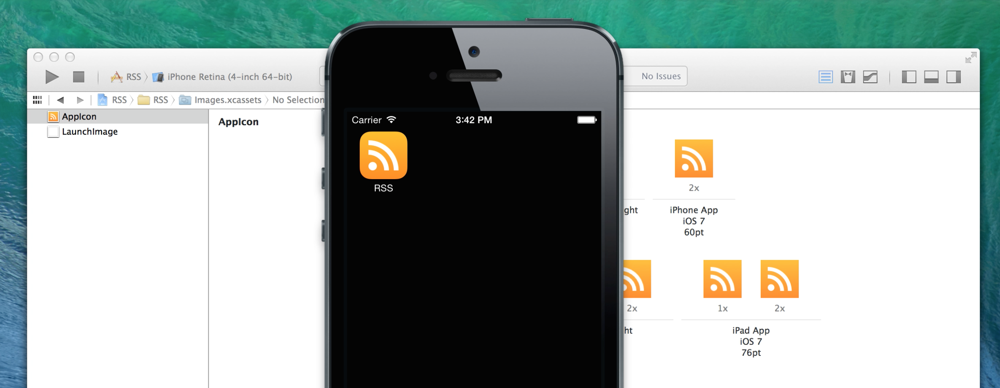

# Automatically Exporting Assets from Sketch into Xcode.



Today, [Bohemian Coding](http://bohemiancoding.com/) released [SketchTool](http://bohemiancoding.com/sketch/tool/). It’s “a command-line app for exporting pages and slices out of .sketch docs.”

Many people use Sketch in their Mac and iOS development workflow. Previously, the process involved making changes in Sketch, exporting them, moving them into Xcode [Asset Catalogs](https://developer.apple.com/library/ios/recipes/xcode_help-image_catalog-1.0/Recipe.html), then running. However, with SketchTool, this can all be done automatically.

### Screencast
<iframe src="//player.vimeo.com/video/93527998" width="680" height="382" frameborder="0" webkitallowfullscreen mozallowfullscreen allowfullscreen></iframe>

[Download](https://github.com/mdznr/Sketch-Xcode/archive/master.zip) the files used in the screencast.

### Installing Sketchtool
You can [download](http://bohemiancoding.com/sketch/tool/) the latest version of Sketchtool from Bohemian Coding’s website. To install it, put both `sketchtool` and `sketchtool resources.bundle` in `/usr/bin`.

Alternatively, use the following lines of code pasted into Terminal to do effectively the same thing:

```
curl -O http://sketchtool.bohemiancoding.com/sketchtool-latest.zip;\
unzip sketchtool-latest.zip;\
sudo cp sketchtool/sketchtool /usr/bin/sketchtool;\
sudo cp -R sketchtool/sketchtool\ resources.bundle/ /usr/bin/sketchtool\ resources.bundle/;\
rm -r sketchtool/;\
rm sketchtool-latest.zip;
```

### Setting up your Sketch files
Many people have their project organized differently, but I prefer to have all Sketch documents in a folder at the root of the project’s directory. I usually name it “Graphics Resources”. This is what I’ll be using in the screencast.

Then, use artboards and slices for the assets you want to export. For example, in my app icon Sketch document (AppIcon.sketch), I have an artboard made for each size of the icon. It’s a modified version of the iOS app icon template bundled with Sketch 3.

### Build scripts
In Xcode, you can add a new run script build phase. Make sure this new build phase occurs before “Copy Bundle Resources”, which copies in Image.xcassets.

The contents of the script should be like:
```
sketchtool export artboards "$PROJECT_DIR"/"Graphics Resources/AppIcon.sketch" --output="$PROJECT_DIR"/"$PROJECT_NAME"/Images.xcassets/AppIcon.appiconset --formats="png"
```

This should be modified and extended for your uses, and I may try to work out a way where this can be done more easily.